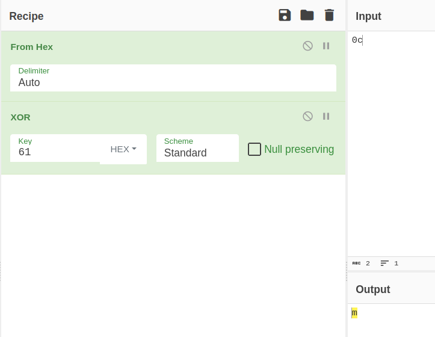

## Crypto/Compact XORs

>Author: skittles1412
>
>294 solves / 246 points

*Note: Below you'll find a guided solution. If interested just in the solve script, click [here](#solve-script-cryptocompactxors)*

#### The Challenge

The challenge states:

```I found some hex in a file called fleg, but I'm not sure how it's encoded. I'm pretty sure it's some kind of xor...```

We are also given a file called `fleg`, which when opened containts some hex digits:

```610c6115651072014317463d73127613732c73036102653a6217742b701c61086e1a651d742b69075f2f6c0d69075f2c690e681c5f673604650364023944```

The first thing i tried is decoding the hex string to see what the output would be and that is when i noticed that i already have half off the flag with every second character being a non printable byte:

```a a e r C F s v s s a e b t p a n e t i _ l i _ i h _ 6 e d 9 ```

#### Getting the full flag


After a bit off tinkering i tried XOR-ing the bytes of the hex string in various ways, and after trying to XOR neighbouring hex number pairs i got some printable output:



### Solve script (Crypto/compactxors)

Using the rule of XOR-ing neighbouring i wrote a python script to iterate through the entire string:

```python
#!/bin/python

from pwn import xor

f = open("fleg")

flagEncoded = f.read().strip()

flag = b""

for i in range (0, len(flagEncoded) - 3, 4):
    flag += bytes.fromhex(flagEncoded[i:i+2])
    flag += xor(bytes.fromhex(flagEncoded[i:i+2]), bytes.fromhex(flagEncoded[i+2:i+4]))

print (flag.decode())

```
After running the script we get the decrypted output: `amateursCTF{saves_space_but_plaintext_in_plain_sight_862efdf9}`.
