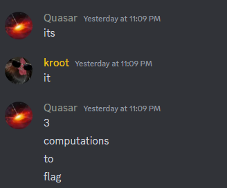

## Crypto/yougetextrainformation1

>Author: hellopir2
>
>239 solves / 298 points

*Note: Below you'll find a guided solution. If interested just in the solve script, click [here](#solve-script-cryptoyougetextrainformation1)*

#### The Challenge

There isn't any text for the challenge just the provided screenshot:




Provided for download are two challenge files: `main.py` and `output.txt`. When we open `main.py` we can see the following code:

```python
from Crypto.Util.number import *
from flag import flag

p = getPrime(512)
q = getPrime(512)
n = p*q
p = p + q
e = 0x10001

extra_information = p + q
ptxt = bytes_to_long(flag)
c = pow(ptxt, e, n)

with open('output.txt', 'w') as f:
    f.write(f"n: {n}\nc: {c}\ne: {e}\nextra_information: {extra_information}")
```

We can see here that this is a pretty simple RSA implementation with just extra information given on the side and by the looks of it by using that extra infromation we'll be able to derieve p and q. And if we take a look into the output file we get exactly what's expected:

```python
n: 83790217241770949930785127822292134633736157973099853931383028198485119939022553589863171712515159590920355561620948287649289302675837892832944404211978967792836179441682795846147312001618564075776280810972021418434978269714364099297666710830717154344277019791039237445921454207967552782769647647208575607201
c: 55170985485931992412061493588380213138061989158987480264288581679930785576529127257790549531229734149688212171710561151529495719876972293968746590202214939126736042529012383384602168155329599794302309463019364103314820346709676184132071708770466649702573831970710420398772142142828226424536566463017178086577
e: 65537
extra_information: 26565552874478429895594150715835574472819014534271940714512961970223616824812349678207505829777946867252164956116701692701674023296773659395833735044077013
```


#### Derieving p and q

By looking at the code we notice one important thing:

```python
n = p*q
p = p + q
e = 0x10001

extra_information = p + q
```

We can use this to derieve p or q just by using some simple math. If we have:

$$n = p * q$$

$$p = p + q$$

$$extra_information = p + q$$

We can combine these equations like:

$$extra_information = p + 2 * q$$

$$p = extra_information - 2 * q$$

$$n = (extra_information - 2 * q) * q$$

$$-2 * q^{2} + extra_information * q - n = 0$$

This is now a basic quadratic equation that we can solve for q. I used [SageMath](https://www.sagemath.org/) to do that:

```python
eq = -2*x^2 + 2656... * x - 8379... == 0

solve(eq, x)

[x == 8128..., x == (1030.../2)]
```

Since only one of the solutions is a whole number i took that as value for q and now i can write the script to decypher the cyphertext.

### Solve script (crypto/yougetextrainformation1)

Here we can just take all the values given in the `output.txt` file and the value for q we calculated and code them into the script. Finally we can just use standard RSA to decrypt the flag:

```python
#!/bin/python
from Crypto.Util.number import *

n = 83790217241770949930785127822292134633736157973099853931383028198485119939022553589863171712515159590920355561620948287649289302675837892832944404211978967792836179441682795846147312001618564075776280810972021418434978269714364099297666710830717154344277019791039237445921454207967552782769647647208575607201
c = 55170985485931992412061493588380213138061989158987480264288581679930785576529127257790549531229734149688212171710561151529495719876972293968746590202214939126736042529012383384602168155329599794302309463019364103314820346709676184132071708770466649702573831970710420398772142142828226424536566463017178086577
e = 65537
extra_information = 26565552874478429895594150715835574472819014534271940714512961970223616824812349678207505829777946867252164956116701692701674023296773659395833735044077013

q = 8128979845892982561867353232387733688040820165501281055994560204992985831326225951788922087412585314864187432126945670029964128100746510232539453211798711

p = extra_information - 2 * q

phi = (p-1) * (q-1)

d = inverse(e, phi)

m = pow(c, d, n)

print (long_to_bytes(m).decode())

```
After running the script we get the decrypted output: `amateursCTF{harder_than_3_operations?!?!!}`.
