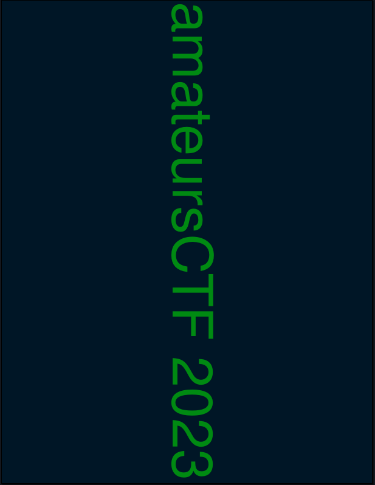

## Forensics/painfullydeepflag

>Author: smashmaster
>
>126 solves / 410 points

The challenge states:

```This one is a bit deep in the stack.```

And we are provided a file `flag.pdf` for download. When We open the file we are get the following screen:



After doing some analysis i tried running `pdf-parser` on it and got the following results:

```
...
obj 7 0
 Type: /XObject
 Referencing: 20 0 R, 21 0 R
 Contains stream

  <<
    /Type /XObject
    /Subtype /Image
    /Width 760
    /Height 342
    /BitsPerComponent 8
    /Length 20 0 R
    /Filter /FlateDecode
    /ColorSpace /DeviceRGB
    /SMask 21 0 R
  >>


obj 20 0
 Type:
 Referencing:


obj 21 0
 Type: /XObject
 Referencing: 22 0 R
 Contains stream

  <<
    /Type /XObject
    /Subtype /Image
    /Width 760
    /Height 342
    /BitsPerComponent 8
    /Length 22 0 R
    /Filter /FlateDecode
    /ColorSpace /DeviceGray
    /Decode [ 1 0 ]
  >>
...
```

This showed me that there may be more images in the file than I'm seeing so I tried running `pdfextract` on it and got some results:

```
Extracted 10 PDF streams to 'flag.dump/streams'.
Extracted 0 scripts to 'flag.dump/scripts'.
Extracted 0 attachments to 'flag.dump/attachments'.
Extracted 1 fonts to 'flag.dump/fonts'.
Extracted 4 images to 'flag.dump/images'.
```

After looking through the images I managed to extract I found the flag:


`amateursCTF{0ut_0f_b0unds}`.
