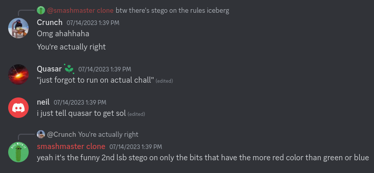

## Forensics/rulesiceberg

>Author: stuxf
>
>154 solves / 377 points

*Note: Below you'll find a guided solution. If interested just in the solve script, click [here](#solve-script-forensicsrulesiceberg)*

#### The Challenge

In this challenge we are presented with a screenshot of a Discord conversation and following description:

```So apparently larry leaked this challenge already. Due to high demand for rules-iceberg stego and server profile picture discord stego, I've decided to release the challenge anyways.```



With that screenshot we are given three files: `rules-iceberg.png`, `new-rules-iceberg.png` and `generate.py`.

Opening the `generate.py` file we are presented with the following code:

```python
from PIL import Image

def encode_lsb(image_path, message):
    # Open the image
    image = Image.open(image_path)
    pixels = image.load()

    # Check if the message can fit within the image
    if len(message) * 8 > image.width * image.height:
        raise ValueError("Message is too long to fit within the image.")

    # Convert the message to binary
    binary_message = ''.join(format(ord(char), '08b') for char in message)

    # Embed the message into the image
    char_index = 0
    for y in range(image.height):
        for x in range(image.width):
            r, g, b, a = pixels[x, y]

            if char_index < len(binary_message):
                # Modify the second least significant bit of the red channel
                # only if red is greater than green and blue
                if r > g and r > b:
                    r = (r & 0xFD) | (int(binary_message[char_index]) << 1)
                    char_index += 1

            pixels[x, y] = (r, g, b, a)

    # Save the modified image
    encoded_image_path = f"new-{image_path}"
    image.save(encoded_image_path)
    print("Message encoded successfully in the image:", encoded_image_path)


# Example usage
image_path = "rules-iceberg.png"

# extract flag from flag.txt
with open("flag.txt", "r") as f:
    flag = f.read().strip()

assert len(flag) == 54

encode_lsb(image_path, flag)
```

#### Solving the challenge

Looking at the script, it does exactly as stated on the screenshot. It hides the flag in the image using LSB but instead of using the last bit of the color it uses the 7th bit. The most important part of thhe script is the following line:

```python
r = (r & 0xFD) | (int(binary_message[char_index]) << 1)
```

So let's analyze it part by part:

```python
r & 0xFD # Sets the 7th bit of the red color to 0

int(binary_message[char_index]) << 1 # Takes a bit of the flag and bitshifts it to the left by a power of 2

(r & 0xFD) | (int(binary_message[char_index]) << 1) # Takes the value gotten from the previous operation and stores it into the 7th bit of the red color
```

With all of that said we can just use the already existing `encode_lsb` function, modify it a bit and make a degenerate function. We just need to use the original image and see what bits have more red than green and blue and then we read the 7th bit of the red channel. If the bit value is zero then the flag bit is also zero, otherwise it is one.


### Solve script (forensics/rulesiceberg)

After writing the decode function we have the following solve script:

```python
from PIL import Image

def encode_lsb(image_path, message):
    # Open the image
    image = Image.open(image_path)
    pixels = image.load()

    # Check if the message can fit within the image
    if len(message) * 8 > image.width * image.height:
        raise ValueError("Message is too long to fit within the image.")

    # Convert the message to binary
    binary_message = ''.join(format(ord(char), '08b') for char in message)

    # Embed the message into the image
    char_index = 0
    for y in range(image.height):
        for x in range(image.width):
            r, g, b, a = pixels[x, y]

            if char_index < len(binary_message):
                # Modify the second least significant bit of the red channel
                # only if red is greater than green and blue
                if r > g and r > b:
                    r = (r & 0xFD) | (int(binary_message[char_index]) << 1)
                    char_index += 1

            pixels[x, y] = (r, g, b, a)

    # Save the modified image
    encoded_image_path = f"new-{image_path}"
    image.save(encoded_image_path)
    print("Message encoded successfully in the image:", encoded_image_path)

def decode_lsb(imagePath, encodedImagePath):

    image = Image.open(imagePath)
    pixels = image.load()

    image1 = Image.open(encodedImagePath)
    pixels1 = image1.load()

    binaryFlag = ""

    char_index = 0

    for y in range(image.height):
        for x in range(image.width):
            r, g, b, a = pixels[x, y]
            r1, g1, b1, a1 = pixels1[x, y]

            if r > g and r > b:

                test = format(r1, '8b')[6]

                if (test == '0'):

                    binaryFlag += '0'

                else:

                    binaryFlag += '1'

    flag = ''.join(chr(int(binaryFlag[i:i+8],2)) for i in range(0,len(binaryFlag),8))

    print(flag)


image_path = "rules-iceberg.png"
encodedImage = "new-rules-iceberg.png"

decode_lsb(image_path, encodedImage)
```
After running the script we get the flag: `amateursCTF{3v3ry0n3_d3f1n1t3ly_l0v3s_st3g0_mhmhmhmhm}`.


