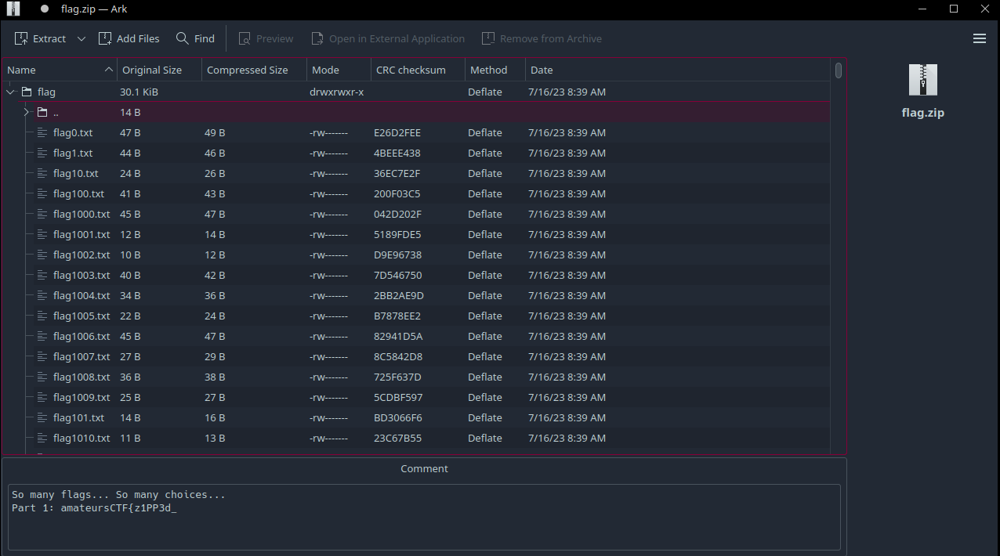
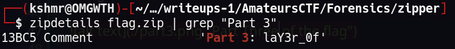
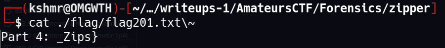

## Forensics/zipper

>Author: flocto
>
>101 solves / 431 points

#### The Challenge

We are given a file called `flag.zip` and the following challenge text:

```
Stare into the zip and the zip stares back..
```

#### Solving the challenge

When opening the zip file we are presented with 1000+ files and some folders which we need to traverse to solve the cahllenge. The flag consists of 4 parts and each one is at a different location.

##### Part One

To get the first part of the flag is pretty easy, you just need to open the zip file:



Part 1: amateursCTF{z1PP3d_

##### Part Two

This is actually the part that took me the longest to find. When I tryed to unzip the file i got multiple errors and those errors are actually tied to the remaining three parts of the flag. As you can see on the picture above there is a folder just named `..`, well this is actually a mistake in the zip file and it is actually a file that needs to be read in order to get the part two of the flag.

There are two solutions to this problem and the first is opening the file in hexeditor and fixing the file while the second is using the python [zipfile](https://docs.python.org/3/library/zipfile.html) library. I found it much faster to write the script that would give me the second part of the flag:

```python
import zipfile

with zipfile.ZipFile("flag.zip") as f:
    f.printdir()
    for line in f.read("flag/").split(b"\n"):
        print(line)
```
Part 2: in5id3_4_

##### Part Three

This part of the flag was also preety easy to find since it is just a comment on one of the files inside the zip. I found it by accident by using the `zipdetails` tool:



Part 3: laY3r_0f

##### Part Four

The final part of the flag regards most of the errors we got trying to unzip the file because everytime I would try to unpack it I would get errors about overwriting existing files. Luckily the zip terminal tool supports unzipping without overwriting anything.

Then after unzipping the files i just read the file `flag201.txt` to get the fourth part of the flag because it was the file that I was getting errors about and it was the first file in the structure of the zip.



Finally we have the whole flag: `amateursCTF{z1PP3d_in5id3_4_laY3r_0f_Zips}`


