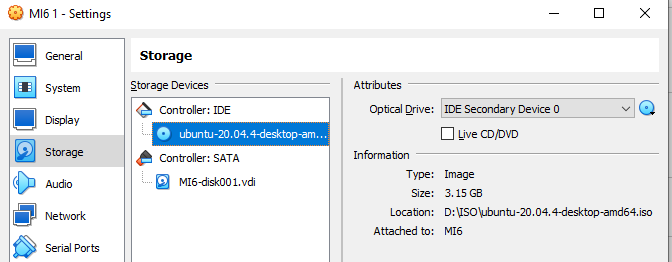
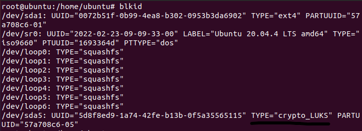
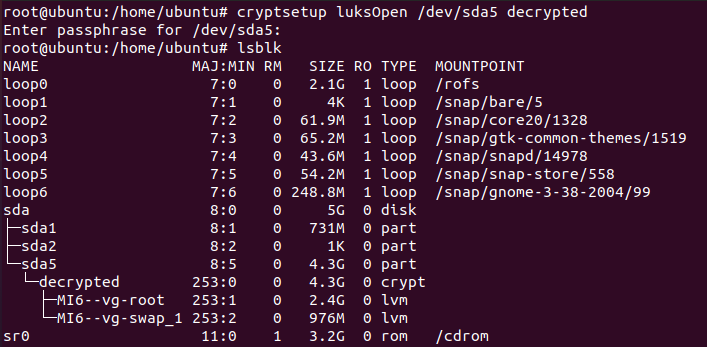
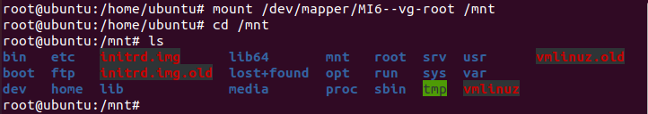
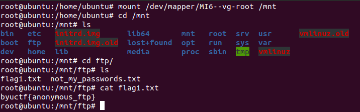
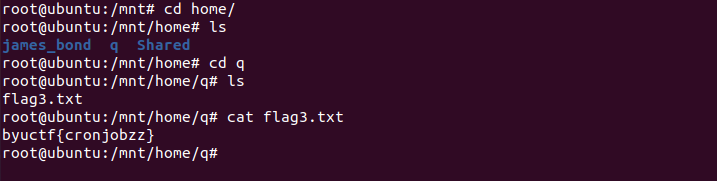
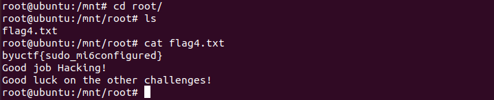

# MI6configuration - Writeup (Solve any local VM challenge basically)
Writeup Author - @refr4g

Level - Hard

Description:
```markdown
We recently acquired a computer at MI6 and it seems like they might have made some mistakes. Can you hack it using their misconfigurations and get all their important data? (Download the VM file and power it on. Find the IP address and start hacking!)

*Note - there are 3 flags, flag2 does not exist*

The password to decrypt volume is the first name of the James Bond character "Q" (all lowercase).

https://byu.app.box.com/s/kqlgq3h7t43jqm7k0q124a1eivkonqln
```

# Solution

We know that the password for decrypting the volume is the first name of the James Bond character "Q". After a bit of googling, we found that it was Major Boothroyd, who is known as Q (which stands for Quartermaster). We found the password for decrypting the volume and it is "major".

We will export the virtual machine (appliance), and on that machine we will insert the ubuntu installation iso file so that we can get a live ubuntu.



Now boot into the ubuntu installation, and select try ubuntu. Then open terminal and login as root.

We have to list block devices and see on which partition are system files of challenge.



We can see that /dev/sda5 device is LUKS crypted and thats what we are looking for, on that device are system files of challenge.

Now we will decrypt it using cryptsetup.



We can see that device has been successfully decrypted.

Mount decrypted root partition to /mnt.



Root partition is successfully decrypted. Now we can get all flags for the challenge.



* **Flag 1** - `byuctf{anonymous_ftp}`



* **Flag 3** - `byuCTF{cronjobzz}`



* **Flag 4** - `byuctf{sudo_mi6configured}`
