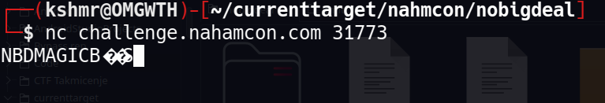
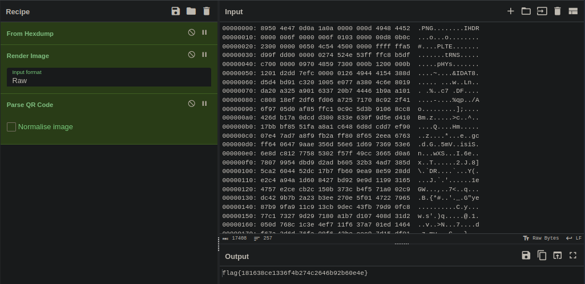

## networks/nobigdeal

>Author: @JohnHammond#6971
>
>500 points

#### The Challenge

At the first glance we are presented with a simple challenge text:
```
lol no dw, it's nbd, u can find the flag.
```

Besides the text we are just presented with a host ip address and port.


#### Looking into the challenge

When using [Netcat](https://netcat.sourceforge.net/) to connect to the host we get the following response:



After looking into the network traffic in [Wireshark](https://netcat.sourceforge.net/) I noticed that the magic bytes never change and then I went on to do some research. That is when I found that there is a protocol called [NBD](https://github.com/NetworkBlockDevice/nbd/blob/master/doc/proto.md) which stands for `Network Block Device` and is used for sharing storage mediums over networks. So I figured that this is the protocol the server is using.

#### Solving the challenge

Luckly there is a tool that can be used to connect to NBD servers called `nbd-client` but when I tryed to connect to the challenge server I got the following message: `warning the oldstyle protocol is no longer supported`. After doing a bit more research on the NBD github I figured out that NBD protocol has a new version of handshake which has been implemented in version 3.10 of the package.

In order to connect to the server I needed an older version which I found at the [NBD Surceforge](https://sourceforge.net/projects/nbd/files/nbd/). After downloading and installing an older version of the package I was finally able to connect to the server using following command:
```
sudo nbd-client challenge.nahamcon.com 30434 /dev/nbd0
```

It executed without errors this time, but when I tried to mount the shared volume I got another error:
```
/mnt is not a block device.
```
This was unexpected so I decided to do a hex dump of the NBD volume in order to inspect it and I got the following result:
```
00000000: 8950 4e47 0d0a 1a0a 0000 000d 4948 4452  .PNG........IHDR
00000010: 0000 006f 0000 006f 0103 0000 00d8 0b0c  ...o...o........
00000020: 2300 0000 0650 4c54 4500 0000 ffff ffa5  #....PLTE.......
00000030: d99f dd00 0000 0274 524e 53ff ffc8 b5df  .......tRNS.....
00000040: c700 0000 0970 4859 7300 000b 1200 000b  .....pHYs.......
00000050: 1201 d2dd 7efc 0000 0126 4944 4154 388d  ....~....&IDAT8.
00000060: d5d4 bd91 c320 1005 e077 a380 4c6e 8019  ..... ...w..Ln..
00000070: da20 a325 a901 6337 20b7 4446 1b9a a101  . .%..c7 .DF....
00000080: c808 18ef 2df6 fd06 a725 7170 8c92 2f41  ....-....%qp../A
00000090: 6f97 05d0 af85 ffc1 0c9c 5d3b 9106 8cc8  o.........];....
000000a0: 426d b17a 0dcd d300 833e 639f 9d5e d410  Bm.z.....>c..^..
000000b0: 17bb bf85 51fa a8a1 c648 6d8d cdd7 ef90  ....Q....Hm.....
000000c0: 07e4 7ad7 a8f9 fb2a ff80 8f65 2eea 6763  ..z....*...e..gc
000000d0: ff64 0647 9aae 356d 56e6 1d69 7369 53e6  .d.G..5mV..isiS.
000000e0: 6e8d c812 7758 5302 f57f 49cc 3665 d0a6  n...wXS...I.6e..
000000f0: 7807 9954 dbd9 d2ad b605 32b3 4ad7 385d  x..T......2.J.8]
00000100: 5ca2 6044 52dc 17b7 fb60 9ea9 8e59 28dd  \.`DR....`...Y(.
00000110: e2c4 a94a 1d60 8427 bd92 9e9d 1199 3165  ...J.`.'......1e
00000120: 4757 e2ce cb2c 150b 373c b4f5 71a0 02c9  GW...,..7<..q...
00000130: dc42 9b7b 2a23 b3ee 270e 5f01 4722 7965  .B.{*#..'._.G"ye
00000140: 87b9 9fa9 11c9 13cb 9dec 43fb 79d9 0fc8  ..........C.y...
00000150: 77c1 7327 9d29 7180 a1b7 d107 408d 31d2  w.s'.)q.....@.1.
00000160: 050d 768c 1c3e 4ef7 11f6 37a7 01ed 1464  ..v..>N...7....d
00000170: f67a 2d6d 76fa 98f6 43be eec9 7d15 df01  .z-mv...C...}...
00000180: a583 3672 0978 cf5d 0000 0000 4945 4e44  ..6r.x.]....IEND
00000190: ae42 6082 0000 0000 0000 0000 0000 0000  .B`.............

```
Obviously this is a PNG image, and at this point there are two solutions to this challenge.

##### In terminal solution

After seeing that the file in question is a PNG image I opened it and saw that it was a QR code. To get the solution we can just use zbarimg:

```
zbarimg /dev/nbd0

QR-Code:flag{181638ce1336f4b274c2646b92b60e4e}
```

##### Cyberchef solution

After getting the hexdump of the file we can use [Cyberchef](https://gchq.github.io/CyberChef/) to get the flag from the image. This is the solution I found first since I wasn't sure if the PNG in question was a QR code or something else. I used the following recipe:



