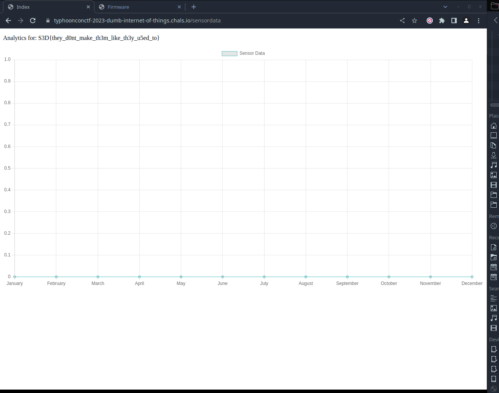

## hardware/dumbiotpart1

#### The Challenge

For the challenge we are just given a link (`typhoonconctf-2023-dumb-internet-of-things.chals.io`) and dump file of the device.

#### First look

Analyzing the `Device.dump` file with the file command we get the following output:

```
Device.dump: Squashfs filesystem, little endian, version 4.0, zlib compressed, 2037751 bytes, 540 inodes, blocksize: 131072 bytes, created: Mon Jun  5 13:12:33 2023
```

Since it is a file system we can mount it and traverse through it. After mounting it we get a standard Linux directory structure with [BusyBox](https://busybox.net/) which indicates that this is some kind of IoT device.

After doing a bit of recon I found an executable called `runProcess` located in the `/usr/bin/` directory which isn't standard. Trying to run the binary yields the following error because of the architecture difference:

```
exec format error: ./runProcess
```

So insted I used [Ghidra](https://ghidra-sre.org/) to analyze the file.


#### Solving the challenge

Once I opened the file in Ghidra I instantly noticed some interesting Base64 strings in the main function:

```
local_d60 = "eyJhbGciOiJIUzI1NiIsInR5cCI6IkpXVCJ9.eyJ1c2VybmFtZSI6InVzZXJuYW1lIiwicGFzc3";
local_d58 = "mFzZiBmbmFzbmtqYmdramFzIGp2rYWtqZyBhapnYUxvcmVtIGlwc3VtIGRvbHIgc2lyIHFmYXNmIGZuYXNua2piZ2tqYXMgamtha2";
local_d50 = "pnIGFramdhTG9yZW0gaXBzdW0gZG9 sciBzaXIgcWZhc2YgZm5hc25ramJna2phha2pnIGrYWtqZyBhapnYUxvcmVtIGlwc3V tIGRv";
local_d48 = "dvcmQiOiJwYXNzd29yZCJ9.Z3L0g6iMMOKVsIPsES_KpHID1l_JQ5tqnKxfM4NMJQkAA";
```

Decoding the first string gave me the following result:

```
{"alg":"HS256","typ":"JWT"}{"username":"username","pass
```

This told me that there is some kind of authentication here. When I tried decoding the rest of the strings I saw that none of them gave any results that were readable so I continued analyzing the main function. The next interesting part of code was:

```
  local_d10 = "https_post";
  local_d08 = "typhoonconctf-2023-dumb-internet-of-things.chals.io";
  local_d00 = &DAT_1200f8178;
  local_cf8 =  "aadasnlnflanslfnlla@lkn24lnn1.knlk12n4knl0lsslkafnal.loiytyyb2bjbbjbfwakmf2uyafikw21ekjrb1kjbgike jbcavkakjfjk" ;
  local_cf0 =  "POST /sensordata HTTP/1.1\r\nHost: %s\r\nContent-Type: text/plain\r\nContent-Length: %zu\r\nCookie: access_token=%s\r\n\r\n%s"
```

At this point it is easy to realize that this binary sends a post request to the site with a specific cookie value. My first hunch was that the cookie value was one of the base64 strings mentioned earlier so I set one of the base64 strings as a cookie named `access_token` and accessed `typhoonconctf-2023-dumb-internet-of-things.chals.io/sensordata` where I found the flag:



